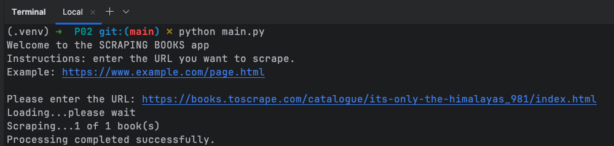
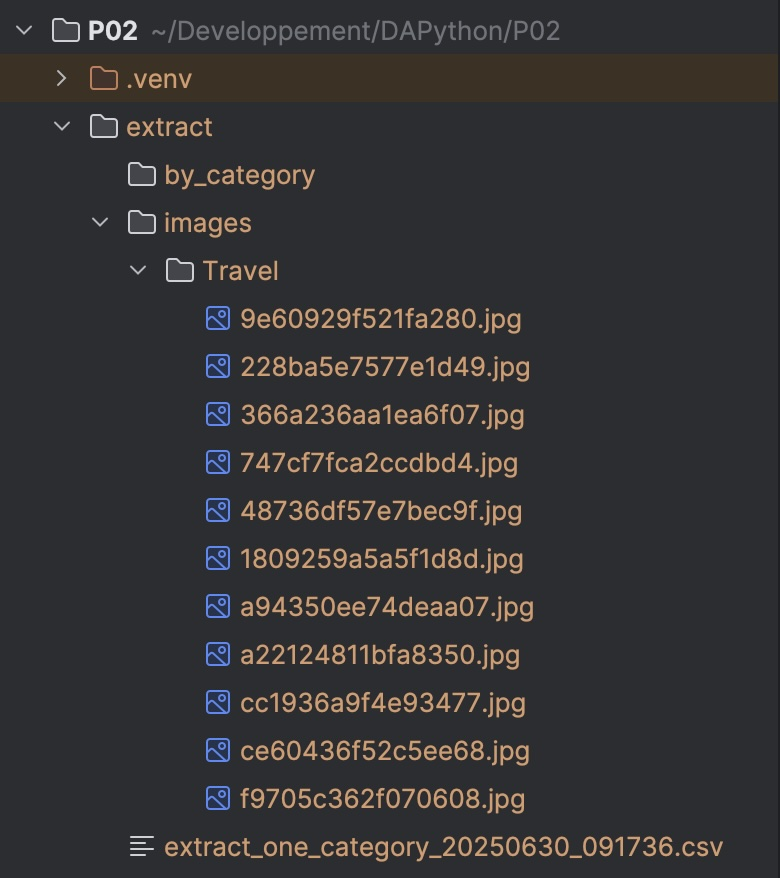

# SCRAPING BOOKS 

# Version
1.0.0 (beta)

## Overview
This application allows you to scrap a website.  
For the development of the beta version, we used the site https://books.toscrape.com/   
Automation will enable you to extract the following information for each product into CSV files :

- product_page_url
- universal_ product_code (upc)
- title
- price_including_tax
- price_excluding_tax
- number_available
- product_description
- category
- review_rating
- image_url

## Installation
1. Clone the project with the command: `git clone https://github.com/GitDrinou/DAPython_P02_Task_Task_Automation.git`
2. Create a virtual environment by running the following lines in your terminal:
   - check if you have access to `venv`: `python -m venv --help`
   - create the environment: `python -m venv venv`
   - activate the environment:
      - for MacOS: `source venv/bin/activate`
      - for Windows: `venv\Scripts\activate`
3. Install the required packages: `pip install -r requirements.txt`

## Usage
Once you have installed all the packages:
- run the following command: `python main.py` 
- follow the instructions displayed in your terminal.

Example terminal output : 

### Extractions folders
- root folder "**extract**", where you will find:
   - a CSV file for a single product
   - a CSV file for a product category
   - a CSV file for all products
- folder "**by_category**", where you will find all CSV files by category
- folder "**images**", where you will find all images by category, named with the UPC.

Example of the result at the end of the process:

