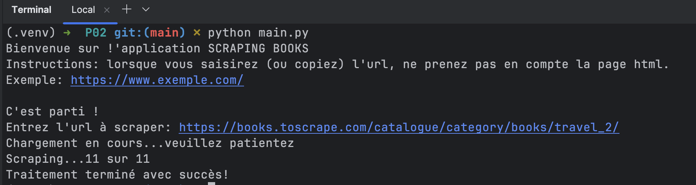

# SCRAPING BOOKS 

# Version
1.0.0 (bêta)

## Fonctionnalité
Cette application va vous permettre de scraper un site web.

Pour le développement de la version bêta, nous avons pris pour exemple le site  https://books.toscrape.com/ 

L'automatisation vous permettra d'extraire dans des fichiers au format CSV les informations suivantes pour chaque produit :

- product_page_url
- universal_ product_code (upc)
- title
- price_including_tax
- price_excluding_tax
- number_available
- product_description
- category
- review_rating
- image_url

## Installation
- Cloner ce projet
- Créer un environnement virtuel exécutez les lignes suivantes dans votre terminal:
   - création: `python -m venv venv`
   - activation: `source venv/bin/activate`
- Installer les packages nécessaires: `pip install -r requirements.txt`

## Utilisation
Une fois que vous avez installé tous les packages:
- exécutez la ligne de commande suivante: `python main.py` 
- suivez les instructions qui sont affichées dans votre terminal.

Exemple de terminal : 

### Dossiers d'extraction
- dossier racine "**extract**", où vous trouverez
   - un fichier CSV pour un produit
   - un fichier CSV pour une catégorie de produits
   - un fichier CSV pour tous les produits
- dossier "**by_category**", où vous trouverez tous les fichiers CSV par catégorie
- dossier "**images**", où vous trouverez toutes les images par catégorie, nommées avec leur UPC.
Exemple de résultat à la fin du traitement:

