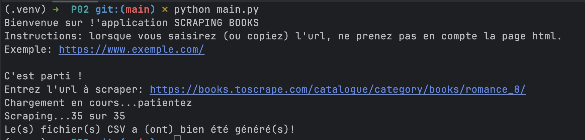

# SCRAPING BOOKS 

# Version
1.0.0 (bêta)

## Définition
Cette application va vous permettre de scraper un site web.
Pour le développement de la version bêta, nous avons pris le site  https://books.toscrape.com/
L'automatisation vous permettra d'extraire dans des fichiers au format CSV les informations suivantes pour chaque produit :

- product_page_url
- universal_ product_code (upc)
- title
- price_including_tax
- price_excluding_tax
- number_available
- product_description
- category
- review_rating
- image_url

## Installation
Exécutez la ligne de commande suivante dans votre terminal, pour installer les packages nécessaires:
`pip install -r requirements.txt`

## Utilisation
Une fois que vous avez installé tous les packages, exécutez la ligne de commande suivante: `python main.py` et suivez les instructions qui sont affichées dans votre terminal.

